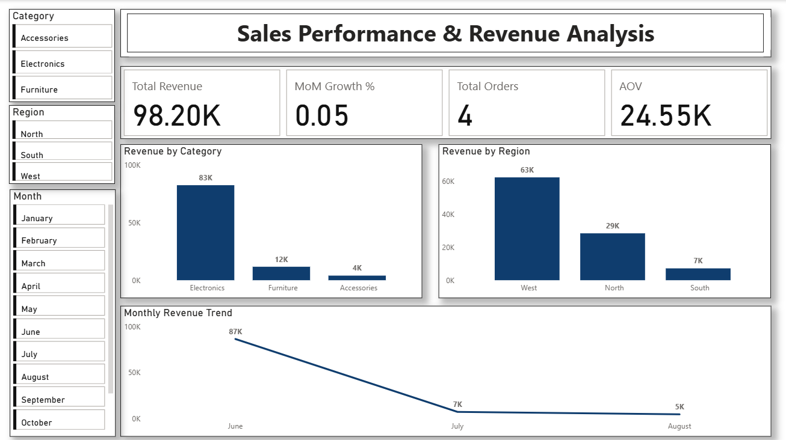

# 📊 Sales Performance Analysis

## 🧾 Objective
The objective of this project is to analyze sales performance data to identify
revenue trends, top-performing product categories, and high-value customers.
The insights generated help stakeholders understand business performance and
support data-driven decision-making.

---

## 🛠 Tools Used
- **MySQL** – Data cleaning, querying, and analysis
- **Power BI** – Data visualization and interactive dashboard creation
- **GitHub** – Project documentation and version control

---

## 📌 Key KPIs
- Total Revenue
- Revenue by Product Category
- Top Customers by Revenue
- Month-over-Month Sales Growth

---

## 📈 Key Analysis Performed
- Identified top revenue-generating product categories
- Analyzed customer contribution to overall revenue
- Evaluated month-over-month sales growth using SQL window functions
- Compared sales performance across different time periods

---

## 📊 Dashboard
An interactive Power BI dashboard was developed to visualize:

- Overall revenue trends
- Category-wise sales performance
- Customer-level revenue contribution
- Month-over-month growth patterns

📌 Dashboard file and screenshots are available in the `dashboard/` and
`images/` folders.

---

## ✅ Outcome & Business Impact
This analysis enabled stakeholders to:
- Track revenue performance effectively
- Identify high-impact product categories
- Focus on high-value customers
- Monitor sales growth trends over time

---

## 👤 Author
**Teenu Awachat**  
Aspiring Data Analyst  
